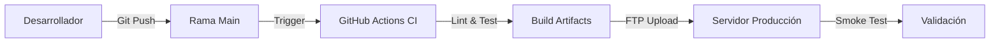

# Playbook de Despliegue (Deployment)

Este documento detalla el ciclo de vida del despliegue en Piel en Armonía, desde el commit hasta producción, garantizando estabilidad y facilidad de rollback.

## 1. Diagrama de Flujo

El proceso de despliegue está completamente automatizado y basado en **Integración Continua (CI)**.



## 2. Estrategia de Despliegue (Deployment Strategy)

Utilizamos un modelo de **Blue/Green simplificado** (donde el "Blue" es el código anterior y "Green" el nuevo, gestionado por Git) con despliegues atómicos basados en archivos.

### Despliegue Automático (GitHub Actions)

El workflow `.github/workflows/deploy-hosting.yml` se encarga de:

1.  Checkout del código.
2.  Instalación de dependencias de producción (`npm ci --omit=dev`).
3.  Empaquetado (`npm run bundle:deploy`).
4.  Subida segura por FTP/SFTP (excluyendo `data/` y `env.php`).
5.  Limpieza de caché en servidor (si aplica).

### Despliegue Manual (Emergencia)

Ver `docs/RUNBOOKS.md` sección 1.2 para instrucciones paso a paso en caso de fallo del CI.

## 3. Feature Flags (Banderas de Funcionalidad)

Para mitigar riesgos, las nuevas funcionalidades deben ocultarse tras **Feature Flags** (`lib/features.php`) antes de fusionarse a `main`.

### Gestión de Flags

Las flags se configuran con la siguiente prioridad (de mayor a menor):

1.  **Variable de Entorno (`.env`):** `FEATURE_NEW_CHECKOUT=true` (Anula todo).
2.  **Redis (Tiempo Real):** `SET features:config '{"new_checkout": true}'`.
3.  **Archivo JSON (`data/features.json`):** Configuración persistente base.
4.  **Código Default:** `lib/features.php` define el estado inicial.

### Rollout Gradual (Canary)

El sistema soporta despliegues porcentuales para probar con un subconjunto de usuarios:

```json
// data/features.json
{
    "new_checkout": {
        "enabled": true,
        "percentage": 10 // Solo 10% de usuarios
    }
}
```

## 4. Procedimiento de Rollback

Si una versión desplegada causa errores críticos:

### Opción A: Revertir Código (Preferido)

1.  En GitHub, localizar el commit problemático.
2.  Hacer clic en "Revert" para crear un nuevo PR que deshaga los cambios.
3.  Fusionar el PR de reversión a `main`.
4.  El CI desplegará automáticamente la versión estable anterior.

### Opción B: Restauración de Datos (Data Loss)

Si hubo corrupción de `store.json`:

1.  Ver `docs/RUNBOOKS.md` sección 5.2.
2.  Restaurar desde `data/backups/store-YYYYMMDD-HHMMSS.json`.

## 5. Validación Post-Deploy

Después de cada despliegue, es **obligatorio** ejecutar las validaciones automáticas:

### Script de Verificación

**Windows (PowerShell):**

```powershell
.\GATE-POSTDEPLOY.ps1 -Domain "https://pielarmonia.com"
```

**Linux/Mac (PHP):**

```bash
php bin/verify-gate.php
```

### Checklist Manual (Smoke Test)

1.  [ ] La página de inicio carga en < 2 segundos.
2.  [ ] `/api.php?resource=health` retorna `status: ok`.
3.  [ ] El formulario de contacto/reserva se abre correctamente.
4.  [ ] No hay errores de consola (F12) rojos.
