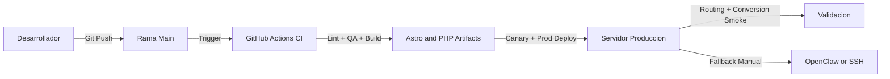

# Playbook de Despliegue (Deployment)

Este documento detalla el ciclo de vida del despliegue en Piel en Armonía, desde el commit hasta producción, garantizando estabilidad y facilidad de rollback.

## 1. Diagrama de Flujo

El proceso de despliegue está completamente automatizado y basado en **Integración Continua (CI)**.


```mermaid
graph LR
    Dev[Desarrollador] -->|Git Push| Main[Rama Main]
    Main -->|Trigger| CI[GitHub Actions CI]
    CI -->|Lint + QA + Build| Build[Astro and PHP Artifacts]
    Build -->|Canary + Prod Deploy| Server[Servidor Produccion]
    Server -->|Routing + Conversion Smoke| Valid[Validacion]
    Server -->|Fallback Manual| VPS[OpenClaw or SSH]
```

## 2. Estrategia de Despliegue (Deployment Strategy)

Utilizamos un modelo de **Blue/Green simplificado** (donde el "Blue" es el código anterior y "Green" el nuevo, gestionado por Git) con despliegues atómicos basados en archivos.

### Despliegue Automático (GitHub Actions)

El workflow `.github/workflows/deploy-hosting.yml` se encarga de:

1.  Checkout del código.
2.  Instalación de dependencias (`npm ci` + `composer install --no-dev`).
3.  Build estático de `Public V3` (`npm run astro:build` + `npm run astro:sync`).
4.  Canary de staging y gate de aceptación cuando staging está configurado.
5.  Publicación a producción por `git-sync`, FTP o SFTP según la configuración activa.
6.  Smoke post-deploy de routing público, conversión pública y manifiesto de cutover.
7.  Dispatch opcional de post-deploy (`post-deploy-fast.yml` y `post-deploy-gate.yml`) con propagación de `admin_rollout_stage` y flags del gate admin UI.

### Dispatch Post-Deploy desde Deploy Hosting

En ejecuciones manuales (`workflow_dispatch`) de `deploy-hosting.yml`:

- `run_postdeploy_fast=true` dispara `post-deploy-fast.yml`.
- `run_postdeploy_gate=true` dispara `post-deploy-gate.yml`.
- `admin_rollout_stage` y flags `admin_rollout_*` se propagan a los workflows post-deploy.

En ejecuciones automáticas (`workflow_run`), la activación se controla con variables:

- `RUN_POSTDEPLOY_FAST_FROM_DEPLOY_WORKFLOW_RUN` (preferido; default `false` para evitar duplicado con trigger `push` de `post-deploy-fast`).
- `RUN_POSTDEPLOY_GATE_FROM_DEPLOY_WORKFLOW_RUN` (preferido; default `false`).
- Compatibilidad legacy: `RUN_POSTDEPLOY_FAST_FROM_DEPLOY` y `RUN_POSTDEPLOY_GATE_FROM_DEPLOY`.

### Despliegue Manual (Emergencia)

Si `git-sync` no replica `origin/main` o GitHub runners no alcanzan el hosting, usar el runbook del VPS:

- [PUBLIC_V2_MANUAL_DEPLOY.md](./PUBLIC_V2_MANUAL_DEPLOY.md)
- [PUBLIC_V3_MANUAL_DEPLOY.md](./PUBLIC_V3_MANUAL_DEPLOY.md)
- Script reusable canónico: `bin/deploy-public-v3-live.sh`
- Compatibilidad temporal: `bin/deploy-public-v2-live.sh` delega a V3

## 3. Feature Flags (Banderas de Funcionalidad)

Para mitigar riesgos, las nuevas funcionalidades deben ocultarse tras **Feature Flags** (`lib/features.php`) antes de fusionarse a `main`.

### Gestión de Flags

Las flags se configuran con la siguiente prioridad (de mayor a menor):

1.  **Variable de Entorno (`.env`):** `FEATURE_NEW_CHECKOUT=true` (Anula todo).
2.  **Redis (Tiempo Real):** `SET features:config '{"new_checkout": true}'`.
3.  **Archivo JSON (`data/features.json`):** Configuración persistente base.
4.  **Código Default:** `lib/features.php` define el estado inicial.

### Rollout Gradual (Canary)

El sistema soporta despliegues porcentuales para probar con un subconjunto de usuarios:

```json
// data/features.json
{
    "new_checkout": {
        "enabled": true,
        "percentage": 10 // Solo 10% de usuarios
    }
}
```

Admin UI admin `sony_v2/sony_v3` usa este mismo modelo con las flags `admin_sony_ui` y `admin_sony_ui_v3`.
Para canary de `sony_v3`, mantener `admin_sony_ui=true` y activar `admin_sony_ui_v3` por env, storage de flags o rollout porcentual.
Runbook operativo: `docs/ADMIN-UI-ROLLOUT.md`.
Gate operativo por etapa: `GATE-ADMIN-ROLLOUT.ps1`.

## 4. Procedimiento de Rollback

Si una versión desplegada causa errores críticos:

### Opción A: Revertir Código (Preferido)

1.  En GitHub, localizar el commit problemático.
2.  Hacer clic en "Revert" para crear un nuevo PR que deshaga los cambios.
3.  Fusionar el PR de reversión a `main`.
4.  El CI desplegará automáticamente la versión estable anterior.

### Opción B: Restauración de Datos (Data Loss)

Si hubo corrupción de `store.json`:

1.  Ver `docs/RUNBOOKS.md` sección 5.2.
2.  Restaurar desde `data/backups/store-YYYYMMDD-HHMMSS.json`.

## 5. Validación Post-Deploy

Después de cada despliegue, es **obligatorio** ejecutar las validaciones automáticas:

### Script de Verificación

**Windows (PowerShell):**

```powershell
.\GATE-POSTDEPLOY.ps1 -Domain "https://pielarmonia.com"
```

**Linux/Mac (PHP):**

```bash
php bin/verify-gate.php
```

### Checklist Manual (Smoke Test)

1.  [ ] `https://pielarmonia.com/` redirige a `/es/`.
2.  [ ] `/api.php?resource=health` retorna `status: ok`.
3.  [ ] `https://pielarmonia.com/es/` y `https://pielarmonia.com/en/` retornan `200`.
4.  [ ] `https://pielarmonia.com/telemedicina.html` redirige a `/es/telemedicina/`.
5.  [ ] El bridge de reserva (`#citas`, `#appointmentForm`, `#serviceSelect`) sigue visible.
6.  [ ] El formulario de contacto/reserva se abre correctamente.
7.  [ ] `admin.html` resuelve variante correcta (`legacy`, `sony_v2` o `sony_v3`) segun `admin_ui`, storage y flags admin.
8.  [ ] `/api.php?resource=features` expone `admin_sony_ui` y `admin_sony_ui_v3` como boolean y alineados con la etapa (`internal`, `canary`, `general`, `rollback`).
9.  [ ] Chunks admin sin residuos:
    - `npm run chunks:admin:prune` (incluido en `npm run build`)
    - opcional: `node bin/clean-admin-chunks.js --dry-run`
10. [ ] No hay errores de consola (F12) rojos.
