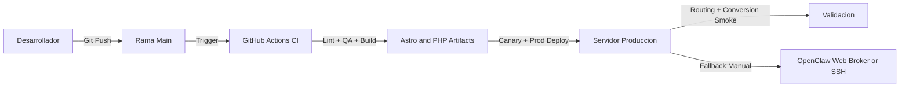

# Playbook de Despliegue (Deployment)

Este documento detalla el ciclo de vida del despliegue en Piel en Armonía, desde el commit hasta producción, garantizando estabilidad y facilidad de rollback.

## 1. Diagrama de Flujo

El proceso de despliegue está completamente automatizado y basado en **Integración Continua (CI)**.


```mermaid
graph LR
    Dev[Desarrollador] -->|Git Push| Main[Rama Main]
    Main -->|Trigger| CI[GitHub Actions CI]
    CI -->|Lint + QA + Build| Build[Astro and PHP Artifacts]
    Build -->|Canary + Prod Deploy| Server[Servidor Produccion]
    Server -->|Routing + Conversion Smoke| Valid[Validacion]
    Server -->|Fallback Manual| VPS[OpenClaw Web Broker or SSH]
```

## 2. Estrategia de Despliegue (Deployment Strategy)

Utilizamos un modelo de **Blue/Green simplificado** (donde el "Blue" es el código anterior y "Green" el nuevo, gestionado por Git) con despliegues atómicos basados en archivos.

### Despliegue Automático (GitHub Actions)

El workflow `.github/workflows/deploy-hosting.yml` se encarga de:

1.  Checkout del código.
2.  Instalación de dependencias (`npm ci` + `composer install --no-dev`).
3.  Build estatico de `Public V6` (`npm run build:public:v6`), generando
    `.generated/site-root/` como stage canonico de `es/**`, `en/**`,
    `_astro/**` y runtimes formalizados; `js/public-v6-shell.js` y los
    assets authored de soporte siguen viviendo en el repo.
4.  Canary de staging y gate de aceptación cuando staging está configurado.
5.  Publicación a producción por bundle canónico (`_deploy_bundle/`) y deploy
    hosting/self-hosted según la configuración activa.
6.  Smoke post-deploy de routing público, conversión pública y manifiesto de cutover.
7.  Dispatch opcional de post-deploy (`post-deploy-fast.yml` y `post-deploy-gate.yml`) con propagación de `admin_rollout_stage`, flags del gate admin UI y politica efectiva de OpenClaw (`require_openclaw_auth`, `require_openclaw_live_smoke`).

Cuando la estrategia activa es `git-sync`, el host solo hace sync del source y
mantiene `public_main_sync` como telemetría/fallback host-side; la fuente
primaria de publicación ya no son artifacts generados comprometidos en `main`.
El cron host-side no recompila Astro en el VPS durante la publicación.

### Dispatch Post-Deploy desde Deploy Hosting

En ejecuciones manuales (`workflow_dispatch`) de `deploy-hosting.yml`:

- `run_postdeploy_fast=true` dispara `post-deploy-fast.yml`.
- `run_postdeploy_gate=true` dispara `post-deploy-gate.yml`.
- `admin_rollout_stage` y flags `admin_rollout_*` se propagan a los workflows post-deploy.

En ejecuciones automáticas (`workflow_run`), la activación se controla con variables:

- `RUN_POSTDEPLOY_FAST_FROM_DEPLOY_WORKFLOW_RUN` (preferido; default `false` para evitar duplicado con trigger `push` de `post-deploy-fast`).
- `RUN_POSTDEPLOY_GATE_FROM_DEPLOY_WORKFLOW_RUN` (preferido; default `false`).
- Compatibilidad legacy: `RUN_POSTDEPLOY_FAST_FROM_DEPLOY` y `RUN_POSTDEPLOY_GATE_FROM_DEPLOY`.

### Despliegue Manual (Emergencia)

Si `git-sync` no replica `origin/main` o GitHub runners no alcanzan el hosting, usar el runbook del VPS:

- [DEPLOY_HOSTING_PLAYBOOK.md](./DEPLOY_HOSTING_PLAYBOOK.md)
- [PUBLIC_V2_MANUAL_DEPLOY.md](./PUBLIC_V2_MANUAL_DEPLOY.md)
- [PUBLIC_V3_MANUAL_DEPLOY.md](./PUBLIC_V3_MANUAL_DEPLOY.md)
- [PUBLIC_MAIN_UPDATE_RUNBOOK.md](./PUBLIC_MAIN_UPDATE_RUNBOOK.md)
- [PUBLIC_V3_CRON_INSTALL.md](./PUBLIC_V3_CRON_INSTALL.md)
- Script reusable canónico: `bin/deploy-public-v3-live.sh`
- Compatibilidad temporal: `bin/deploy-public-v2-live.sh` delega a V3

El wrapper `bin/deploy-public-v3-live.sh` resetea el repo al commit objetivo,
instala dependencias PHP si hace falta, verifica que existan los artefactos
versionados de publicación en `.generated/site-root/` o en copias root de
compatibilidad y luego recarga Nginx. No regenera los artefactos V6 en el
servidor.

Contrato operativo local:

- El servidor de desarrollo/pruebas locales usa `http://127.0.0.1:8011` y
  suites reutilizables deben entrar por `TEST_BASE_URL`.
- `bin/deploy-public-v3-live.sh` verifica el host servido por Nginx del VPS y
  permite override con `LOCAL_VERIFY_BASE_URL` (default `http://127.0.0.1:8080`).

Runbook validado para el servidor actual:

- el host ya tenia `/root/sync-pielarmonia.sh`
- el bloqueo real fue `Permission denied` en `bin/deploy-public-v3-live.sh`
- la recuperacion validada fue `chmod +x`, sync manual con `flock` y verificacion posterior del admin `sony_v3`

Si se usa `npm run bundle:deploy`, el ZIP conserva los wrappers raiz junto con
`scripts/ops/prod`, `scripts/ops/setup` y `bin/powershell` para mantener
operativos los scripts PowerShell incluidos fuera del repo.

## 3. Feature Flags (Banderas de Funcionalidad)

Para mitigar riesgos, las nuevas funcionalidades deben ocultarse tras **Feature Flags** (`lib/features.php`) antes de fusionarse a `main`.

### Gestión de Flags

Las flags se configuran con la siguiente prioridad (de mayor a menor):

1.  **Variable de Entorno (`.env`):** `FEATURE_NEW_CHECKOUT=true` (Anula todo).
2.  **Redis (Tiempo Real):** `SET features:config '{"new_checkout": true}'`.
3.  **Archivo JSON (`data/features.json`):** Configuración persistente base.
4.  **Código Default:** `lib/features.php` define el estado inicial.

### Rollout Gradual (Canary)

El sistema soporta despliegues porcentuales para probar con un subconjunto de usuarios:

```json
// data/features.json
{
    "new_checkout": {
        "enabled": true,
        "percentage": 10 // Solo 10% de usuarios
    }
}
```

El admin ya no usa feature flags para resolver UI runtime.
`admin.html` arranca siempre en `sony_v3`.
Runbook operativo: `docs/ADMIN-UI-ROLLOUT.md`.
Gate operativo: `GATE-ADMIN-ROLLOUT.ps1` (implementacion canonica:
`scripts/ops/admin/GATE-ADMIN-ROLLOUT.ps1`).
La validacion activa usa `tests/admin-ui-runtime-smoke.spec.js` y `tests/admin-v3-canary-runtime.spec.js` como contrato estable de V3-only.

## 4. Procedimiento de Rollback

Si una versión desplegada causa errores críticos:

### Opción A: Revertir Código (Preferido)

1.  En GitHub, localizar el commit problemático.
2.  Hacer clic en "Revert" para crear un nuevo PR que deshaga los cambios.
3.  Fusionar el PR de reversión a `main`.
4.  El CI desplegará automáticamente la versión estable anterior.

### Opción B: Restauración de Datos (Data Loss)

Si hubo corrupción de `store.json`:

1.  Ver `docs/RUNBOOKS.md` sección 5.2.
2.  Restaurar desde `data/backups/store-YYYYMMDD-HHMMSS.json`.

## 5. Validación Post-Deploy

Después de cada despliegue, es **obligatorio** ejecutar las validaciones automáticas:

### Script de Verificación

**Windows (PowerShell):**

```powershell
.\scripts\ops\prod\GATE-POSTDEPLOY.ps1 -Domain "https://pielarmonia.com"
```

Implementacion canonica: `scripts/ops/prod/GATE-POSTDEPLOY.ps1`.

**Linux/Mac (PHP):**

```bash
php bin/verify-gate.php
```

### Checklist Manual (Smoke Test)

1.  [ ] `https://pielarmonia.com/` redirige a `/es/`.
2.  [ ] `/api.php?resource=health` retorna `status: ok`.
3.  [ ] `https://pielarmonia.com/es/` y `https://pielarmonia.com/en/` retornan `200`.
4.  [ ] `https://pielarmonia.com/telemedicina.html` redirige a `/es/telemedicina/`.
5.  [ ] La portada V6 expone las tres rutas maestras (`primera consulta`, `tratamientos`, `teledermatologia`) y muestra un siguiente paso claro.
6.  [ ] Los CTA públicos redirigen correctamente a la ruta esperada (`/es/servicios/`, `/es/telemedicina/` y equivalentes en `en/`) sin depender de anchors legacy.
7.  [ ] `admin.html` arranca en `sony_v3` aunque reciba params legacy (`admin_ui`, `admin_ui_reset`).
8.  [ ] `GATE-ADMIN-ROLLOUT.ps1 -RequireOpenClawAuth` valida shell `sony_v3`, ausencia de CSS legacy y contrato OpenClaw `web_broker`.
        Implementacion canonica: `scripts/ops/admin/GATE-ADMIN-ROLLOUT.ps1`.
9.  [ ] `npm run smoke:admin:openclaw-auth:live:node` valida broker sandbox, shared session admin/turnero y logout.
10. [ ] Chunks admin sin residuos:
    - `npm run chunks:admin:prune` (incluido en `npm run build`)
    - opcional: `npm run chunks:admin:check`
11. [ ] No hay errores de consola (F12) rojos.
